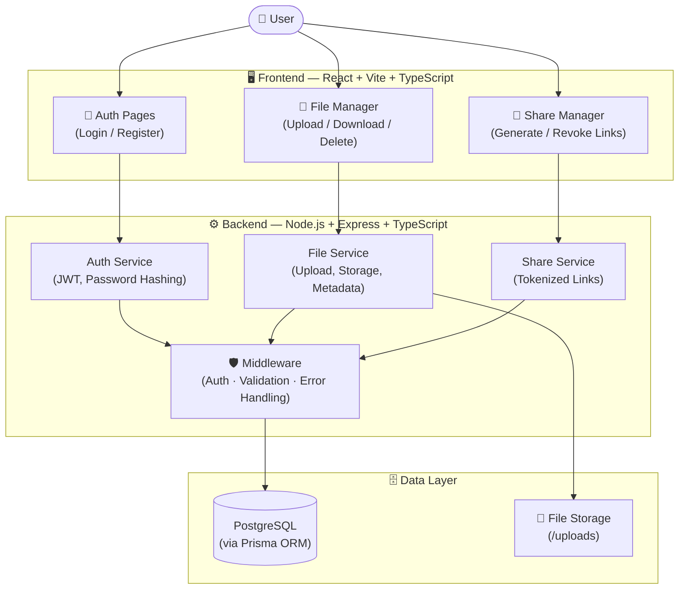

# 🔐 Secure File Sharing Platform

A full-stack secure file sharing system that allows authenticated users to upload files and generate controlled, shareable download links with expiration and access limits.

---

## 🚀 Project Overview

This project focuses on implementing **backend security concepts** in a real-world application, including:

- Secure authentication (JWT-based)
- Controlled file access
- Tokenized sharing system
- Authorization and access validation

Users can upload files, manage them, and generate secure links for sharing with others.

---

## 🧱 Tech Stack

| Layer | Technology |
|---|---|
| **Frontend** | React 18 + TypeScript + Vite, Tailwind CSS (Dark Mode), Native Fetch API |
| **Backend** | Node.js + TypeScript, Express.js, Prisma ORM |
| **Database** | PostgreSQL |
| **Infrastructure** | Docker + Docker Compose |

---

## ✨ Features

### 🔐 Authentication
- User registration & login
- JWT-based authentication (Access + Refresh tokens)
- Secure password hashing

### 📤 File Management
- Upload files with validation
- Unique file storage handling
- Download and delete functionality
- User-specific file access (authorization)

### 🔗 Secure File Sharing
- Generate tokenized download links
- Expiration time support
- Download limits
- Link revocation

### 📥 Download Security
- Token validation
- Expiry checks
- Download tracking

### 🎨 Frontend Experience
- Drag & drop uploads
- Skeleton loaders
- Toast notifications
- Responsive UI with dark mode

---

## 🏗️ Architecture



---

## 📂 Project Structure
```
root/
│
├── backend/
│   ├── src/
│   │   ├── config/        # App & environment configs
│   │   ├── controllers/   # Request handlers
│   │   ├── middleware/    # Auth, validation, error handling
│   │   ├── prisma/        # Prisma client setup
│   │   ├── routes/        # API routes
│   │   ├── services/      # Business logic layer
│   │   ├── types/         # TypeScript types
│   │   ├── utils/         # Helper utilities
│   │   └── server.ts      # Entry point
│   │
│   ├── uploads/           # Stored files
│   ├── prisma/            # Prisma schema & migrations
│   ├── Dockerfile
│   ├── .env
│   └── package.json
│
├── frontend/
│   ├── src/
│   │   ├── components/
│   │   │   ├── auth/      # Auth UI components
│   │   │   ├── file/      # File-related components
│   │   │   ├── layout/    # Layout components
│   │   │   └── ui/        # Reusable UI elements
│   │   │
│   │   ├── context/       # Global state (Auth, etc.)
│   │   ├── assets/        # Static files
│   │   └── ...
│   │
│   ├── public/
│   └── package.json
├── .gitignore
├── .env.example/
├── LICENSE
├── docker-compose.yml
└── README.md
```

---

## ⚙️ Setup Instructions

### 1️⃣ Clone the Repository

```bash
git clone <your-repo-url>
cd <project-folder>
```

### 2️⃣ Run Backend + Database (Docker)

```bash
cd backend
docker-compose up --build
```

This will spin up:
- ✅ Backend server
- ✅ PostgreSQL database

### 3️⃣ Run Frontend (Locally)

```bash
cd frontend
npm install
npm run dev
```

Frontend available at **http://localhost:5173**

---

## 🔐 Security Highlights

| Feature | Implementation |
|---|---|
| Password hashing | Secure hashing algorithm |
| Authentication | JWT with expiration |
| Session management | Refresh token handling |
| File access control | Owner-only authorization |
| Secure sharing | Tokenized download links |
| Input validation | Zod schema validation |
| Upload protection | File type & size validation |

---

## 🧪 API Reference

### Auth
| Method | Endpoint | Description |
|---|---|---|
| `POST` | `/auth/register` | Register a new user |
| `POST` | `/auth/login` | Login and receive tokens |
| `POST` | `/auth/refresh` | Refresh access token |
| `POST` | `/auth/logout` | Invalidate session |

### Files
| Method | Endpoint | Description |
|---|---|---|
| `POST` | `/files/upload` | Upload a file |
| `GET` | `/files` | List user's files |
| `DELETE` | `/files/:id` | Delete a file |

### Share
| Method | Endpoint | Description |
|---|---|---|
| `POST` | `/share` | Generate a share link |
| `GET` | `/download/:token` | Download via token |
| `DELETE` | `/share/:id` | Revoke a share link |

---

## 🚧 Future Improvements

- [ ] CI/CD pipeline integration
- [ ] Cloud storage (AWS S3)
- [ ] Rate limiting with Redis
- [ ] File encryption at rest
- [ ] Advanced UI/UX improvements

---

## 📸 Screenshots

> Add screenshots or GIFs here for better presentation

---

## 👨‍💻 Author

Built as a full-stack project to demonstrate:
- Secure backend architecture
- Authentication & authorization
- File handling and sharing systems
- Clean frontend integration
